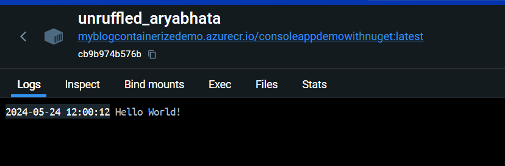

# Demo
this is a project to demo the use of a private NuGet feed in a .NET project. The nuget package itself is a simple class library that returns a hello world string.
some things to pay attention to:
the nuget.config file:
```xml
<?xml version="1.0" encoding="utf-8"?>
<configuration>
  <packageSources>
    <clear />

    <add key="LocalPackagesDemo" value="https://pkgs.dev.azure.com/LaurentAerens/2c2e3cab-e1e3-45e4-aa52-0331175b406e/_packaging/LocalPackagesDemo/nuget/v3/index.json" />

  </packageSources>
</configuration>
```
This is a link to the HelloWorldContainerizedDemo\HelloWorldContainerizedDemo.csproj nuget that is hosted in the Azure DevOps feed. 
next to this we have the HelloWorldContainerizedDemo\HelloWorldContainerizedDemo.csproj file:
```xml
<Project Sdk="Microsoft.NET.Sdk">

  <PropertyGroup>
    <OutputType>Exe</OutputType>
    <TargetFramework>net8.0</TargetFramework>
    <ImplicitUsings>enable</ImplicitUsings>
    <Nullable>enable</Nullable>
    <EnableSdkContainerSupport>true</EnableSdkContainerSupport>
    <ContainerRepository>ConsoleAppDemoWithNuget</ContainerRepository>
  </PropertyGroup>

  <ItemGroup>
    <PackageReference Include="HelloWorldContainerizedDemo" Version="1.0.0" />
  </ItemGroup>

</Project>
```
Here we pay attention to the EnableSdkContainerSupport that is set to true. This is needed to containerize a console application. And also the ContainerRepository that is set to ConsoleAppDemoWithNuget. This is the name of the container image that will be created.
With this all set we can simply run the following command to containerize the application:
```bash
dotnet publish  /t:PublishContainer
```
It is cool to see how the nuget package are automatically dealed with and the container image is created.

If i then run the image in docker desktop i get the following output:


# DevOps
in the [pipeline](../azure-pipelines.yml) we can see the following steps to automate this:
```yaml
- task: DotNetCoreCLI@2
  displayName: 'Restore NuGet Packages'
  inputs:
    command: 'restore'
    projects: 'DemoAppWithPrivateNugetFeed/DemoAppWithPrivateNugetFeed.csproj'
    feedsToUse: 'config'
    nugetConfigPath: 'DemoAppWithPrivateNugetFeed/nuget.config'

- task: DotNetCoreCLI@2
  displayName: 'Basic Publish DemoAppsWithPrivateNugetFeed'
  inputs:
    command: 'publish'
    projects: 'DemoAppWithPrivateNugetFeed/DemoAppWithPrivateNugetFeed.csproj'
    publishWebProjects: false
    ZipAfterPublish: false
    arguments: '/t:PublishContainer -p ContainerRegistry=myblogcontainerizedemo.azurecr.io'
```	
