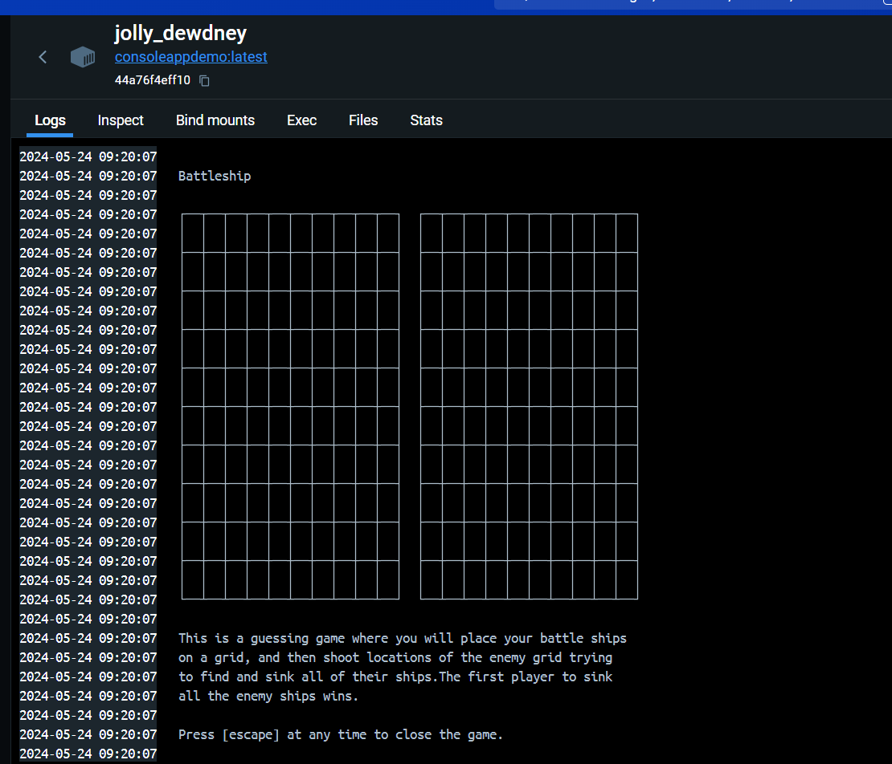

# Original Code on: https://github.com/dotnet/dotnet-console-games
# Demo
this is a project on how to use dotnet publish to make a container image of a console application. The console application is a battleship game.
the TestConsoleApp\TestConsoleApp.csproj ²
```xml
<Project Sdk="Microsoft.NET.Sdk">

  <PropertyGroup>
    <OutputType>exe</OutputType>
    <TargetFramework>net8.0</TargetFramework>
    <ImplicitUsings>enable</ImplicitUsings>
    <Nullable>enable</Nullable>
    <EnableSdkContainerSupport>true</EnableSdkContainerSupport>
    <ContainerRepository>ConsoleAppDemo</ContainerRepository>
  </PropertyGroup>

  <ItemGroup>
    <PackageReference Include="Towel" Version="1.0.40" />
  </ItemGroup>

</Project>
```
Here we pay attention to the EnableSdkContainerSupport that is set to true. This is needed to containerize a console application. And also the ContainerRepository that is set to ConsoleAppDemo. This is the name of the repository where the container image will be pushed to. 
The console application is published to a container by running the following command:
```bash
dotnet publish  /t:PublishContainer
```

If i then run the image in docker desktop i get the following output:
