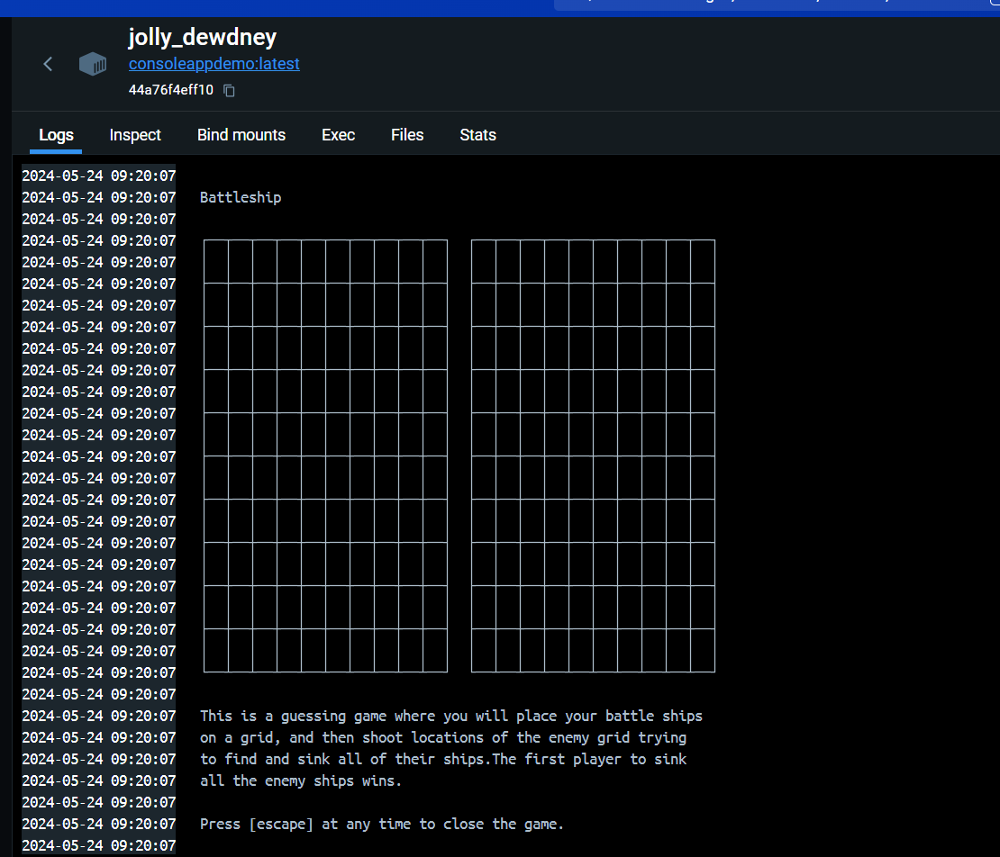
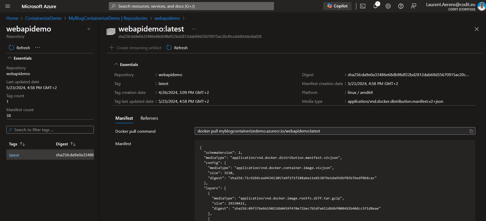

# Containerize a .NET app without using Dockerfiles
Are you tired of writing Dockerfiles for your .NET applications? Do you want to containerize your .NET applications without using Dockerfiles? Then this blog post is for you!
Being part of a modern company that is focused on the cloud you might think we all love Docker and Containers. But the truth is some (amazing) application developers think it is unnecessary.
They are used to just Zipping there file and deploying it to a PaaS service. They are no containerize guys, they are .net developers. And it seems that microsoft agrees with them.
They are of the opinion that writing dockerfiles is unnecessary and that publishing a .NET application as a container should be as easy as any other deployment.
In this blog post, I will take a deep dive into how to containerize a .NET application without using Dockerfiles. I will show you how to use the `dotnet publish` command to publish a .NET application as a container.

## Build image tool
This is an open source tool that was already developed in april 2022. It calls itself "A .NET global tool to create container images from .NET projects, because life is too short to write Dockerfiles."
I will not focus on this tool but i feel i'm obligated to give a quick demo as it is quite cool. You can find the tool [here](https://github.com/tmds/build-image)
installing the tool is as easy as running the following command:
```bash
dotnet tool install -g dotnet-build-image
```
After installing the tool you can run the following command to build an image:
```bash
dotnet build-image -t {name}:{tag}
```
## dotnet publish
This is a new fearure that was added in the .NET 8.0 SDK (.NET 7.0 as a nuget package). It allows your .net publish to output a container image. The official docs with all the option can be found [here](https://learn.microsoft.com/en-us/dotnet/core/docker/publish-as-container?pivots=dotnet-8-0)
### dotnet worker
As in the Demo I show a worker, but i will also show other types of .net applications.
As you will see getting a container image for any resource is very easy. You just need to add the following line to the csproj file:
```xml
<PropertyGroup>
    ...
    <ContainerRepository>{name}</ContainerRepository>
</PropertyGroup>
```
The container needs a name after all. After this it is as simple as running the following command:
```bash
dotnet publish /t:PublishContainer
```
A demo can be found [here](https://github.com/LaurentAerens/PublishContainerizer) and in the official docs [here](https://learn.microsoft.com/en-us/dotnet/core/docker/publish-as-container?pivots=dotnet-8-0)
### Console app
Creating a container image for a console app is very similar with one small difference. You need to add the following lines to the csproj file:
```xml
<PropertyGroup>
    ...
    <EnableSdkContainerSupport>true</EnableSdkContainerSupport>
    <ContainerRepository>{name}</ContainerRepository>
</PropertyGroup>
```
and then run the following command:
```bash
dotnet publish /t:PublishContainer
```
#### Demo
Here a quick demo (code can be found [here](https://github.com/LaurentAerens/PublishContainerizer)), this demo uses the battleship game from this [open source project](https://github.com/dotnet/dotnet-console-games)
If you look at the csproj file you will see the following lines:
```xml
<Project Sdk="Microsoft.NET.Sdk">

  <PropertyGroup>
    <OutputType>exe</OutputType>
    <TargetFramework>net8.0</TargetFramework>
    <ImplicitUsings>enable</ImplicitUsings>
    <Nullable>enable</Nullable>
    <EnableSdkContainerSupport>true</EnableSdkContainerSupport>
    <ContainerRepository>ConsoleAppDemo</ContainerRepository>
  </PropertyGroup>

  <ItemGroup>
    <PackageReference Include="Towel" Version="1.0.40" />
  </ItemGroup>

</Project>
```
In the terminal you can see the following output:
```bash
PS {path}\PublishContainerizer\TestConsoleApp> dotnet publish  /t:PublishContainer
MSBuild version 17.9.8+610b4d3b5 for .NET
  Determining projects to restore...
  All projects are up-to-date for restore.
  TestConsoleApp -> {path}\PublishContainerizer\TestConsoleApp\bin\Release\net8.0\TestConsoleApp.dll
  TestConsoleApp -> {path}\PublishContainerizer\TestConsoleApp\bin\Release\net8.0\publish\
  Building image 'consoleappdemo' with tags 'latest' on top of base image 'mcr.microsoft.com/dotnet/runtime:8.0'.
  Pushed image 'consoleappdemo:latest' to local registry via 'docker'.
```
If i then run it in docker desktop i see a working battleship game.

### api
creating a container image for an .net api is extremely easy. You just need to add the following lines to the csproj file:
```xml
<PropertyGroup>
    ...
    <PublishProfile>DefaultContainer</PublishProfile>
    <ContainerRepository>{name}</ContainerRepository>
</PropertyGroup>
```
after this it is as simple as running the following command:
```bash
dotnet publish
``` 
A demo will be shown at the devops section of this blog post.
## Azure Function
Creating a container image for an Azure Function is also very easy. You just need to add the following lines to the csproj file:
```xml
<PropertyGroup>
    ...
    <ContainerRepository>{name}</ContainerRepository>
    <ContainerBaseImage>mcr.microsoft.com/azure-functions/dotnet-isolated:4-dotnet-isolated8.0</ContainerBaseImage>
</PropertyGroup>
```
then is you run:
```bash
dotnet publish /t:PublishContainer
```
you will discover that the Azure Function is not working. This feature is unfortunately **not yet supported** by the Azure Functions runtime. You can only publish a function as a container if you have a Dockerfile.
You can follow the official issue [here](https://github.com/Azure/azure-functions-core-tools/issues/3355) and [here](https://github.com/dotnet/sdk-container-builds/issues/411) for updates.
I really hope they add this soon because i mainly program Azure Functions.
## Other Languages
This feature is a .net feature but the demo's only use c# code. So i was wondering if this also work on the other languages in the .net ecosystem. I will test F# and VB.NET.
### F#
I wrote both a F# api, it is the basic api an to my surprise if works the exact same way as the c# api. I only had to add the following lines to the fsproj file:
```xml
<PropertyGroup>
    ...
    <PublishProfile>DefaultContainer</PublishProfile>
    <ContainerRepository>{name}</ContainerRepository>
</PropertyGroup>
```
and then run the following command:
```bash
dotnet publish
```
And you get a working F# api in a container.
### VB.NET
I also wrote a VB.NET console app. To be clear we never use VB.NET in our company but i wanted to test it. To my surprise it also works the same way as the c# console app. The code and demo can be found [here](https://github.com/LaurentAerens/PublishContainerizer).
## DevOps
This is all cool and nice but i'm not going to type the command into the terminal i want to use CI/CD. But there are no clear guides online so i will make one for you.
I'm assuming that you have modified the csproj file as shown in the previous sections.
the first task is alway a docker login into your ACR:

```yaml
- task: Docker@2
  inputs:
    containerRegistry: 'MyDemoACR'
    command: 'login'
```
### Basic api release
for this demo i will use the very basic weather forecast api that is created when you create a new .net api. I will use the following task:
```yaml    
- task: DotNetCoreCLI@2
  displayName: 'Basic Publish TestAPI'
  inputs:
    projects: 'TestAPI/TestAPI.csproj'
    command: 'publish'
    publishWebProjects: false
    arguments: '-p ContainerRegistry=myblogcontainerizedemo.azurecr.io'
    zipAfterPublish: false
```
If you set publishWebProjects to true it will publish all api in the solution. As you can see there is noting complicated about this.
In the ACR you can see the following image:

having the nice size of 220.46 MB, but what if i want it to be alpine based, and only support linux-x64. This you can find in the next section.  
### Advanced api release

### Private nuget feed
